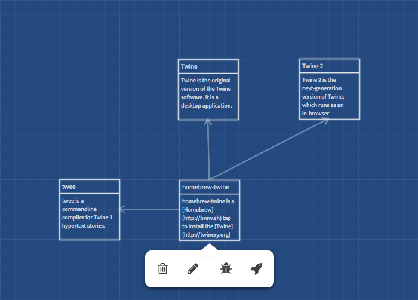

homebrew-twine
==============



This repository is a [Homebrew](http://brew.sh) [tap](https://github.com/Homebrew/homebrew/blob/master/share/doc/homebrew/Interesting-Taps-%26-Branches.md) to install the [Twine](http://twinery.org) hypertext authoring tool.

To install software from this repository, run the following:

```sh
brew tap mistydemeo/twine
```

You should then be able to install any of the packages in this repository - for instance, `brew install twine2`.

Packages
--------

## Twine

Twine is the original desktop application version of the Twine software.

## Twine 2

Twine 2 is the next-generation version of Twine, which runs as an in-browser application. It features improved syntax and authoring tools, and many new features.

## twee

Twee is a commandline compiler for Twine 1 hypertext stories.
